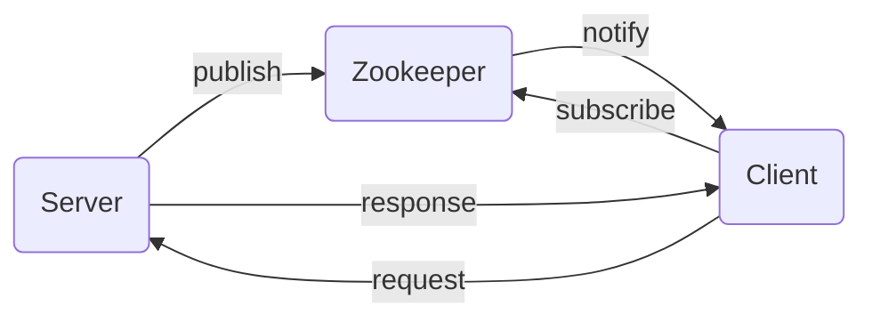

# handwrite-rpc
Hand write RPC framework in Java

>Zookeeper(to be done)

>Netty(to be done)

>protoBuffer(to be done)

Between the Client and the Server, the data handled by Netty, which is a NIO framework.
Protobuffer used to encode the data into binary, as a mean to enhance the performance

